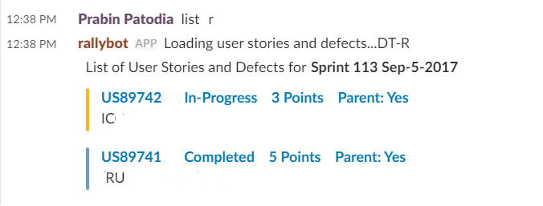

# Rally Slackbot
[](https://travis-ci.org/paypal/rallyslack)

Author: [Jackson Lim](https://github.com/Xerxous)

The Rally Slackbot is a utility for Slack users to quickly access and modify Rally.


-----

-----

## Usage

### Slackbot Commands

The Rally Slackbot application uses the input from the Slackbot to execute commands using the Rally API, allowing users to query, update, create, read, and delete user stories.

-----

`list <project> [? iteration number]`

List all stories for the current iteration. Adding the iteration parameter lists all stories for the specified iteration. Returns story ids linked to the URL, titles, estimation points, availability of parent user story for the returned story and the status of each story. Querying a parent project will not return the user stories and defects of its children. Current iteration number is taken as default if no iteration number is provided with the query. 

-----

`tasks <story id | defect id>`

List all tasks for a specified story or defect. Returns task ids linked to the URL, title, and the description of each task.

-----

`create task <story id | defect id> <task name>`

Creates a task for a specific user story.

-----

`accept <story id | defect id>`

Change the state of the story or defect to "Accept". Return a message and URL as links to the user story or defect.

-----

`start <task id>`

`complete <task id>`

Change the status of the task. Return a message and URL as links to the task.

-----

`search <project> ? <keyword>`

Searches user stories and defects by keywords for this iteration. Returns story ids linked to the URL, titles, and the status of each story.

-----

`create alias <alias> <project>`

Create an alias, consisting of at most 20 alpha-numeric characters, linked with a rally project name. See the alias criteria below for more information.

-----

`remove alias <alias>`

Remove an alias.

-----

`alias`

List all the alias for the bot.

-----

`help`

List all commands and their descriptions.

-----

Conventions:

- When creating a task, the task name cannot contain any spaces
- All IDs are noted by two capital letters - TA (Task), DE(Defect), US(User Story) - followed by a number.
- Iteration takes the iteration number. For example, if the current iteration is Sprint 43 Jul-12-2009 for the project Team 1, the list command is:
  ```
  list Team 1 ? 43
  ```
- Projects and keywords may contain spaces

### Aliases

The alias is a feature where you can substitute a word for the project. Instead of typing the full name of the project, you will be able to type the alias in the commands for convenience.

To add an alias, send the "create alias" command to to rallybot. Example:
```
create alias myteam Rally Team 1
list myteam ? 12
```

There are some rules to creating an alias:

- An alias cannot be a project name.
- The project under an alias must be a legitimate project in your Rally
- One project CAN have multiple aliases
- Try not to remove an alias you did not create it.

### Auditing

This feature appends to the note section of the user story or task to log written changes: whom and when. The message will be under the line *** Rallybot *** to note the start of the audit.


## Set up your Slackbot

1. **Install Node.js**

  Install the latest version of Node.js

  Node.js: https://nodejs.org/en/

  After installing, test it by typing `node` in your command line.

2. **Create a Slackbot**

  Create a new Slackbot for the Rally Slackbot

  Slack bots: https://api.slack.com/bot-users

  Scroll down to "create a new bot user" and start making your bot!

3. **Slack API Key**

  Retrieve the Slack key after making the bot.

  Copy and paste this key into `config.json` under the `slackBotKey` property.

4. **Slack Web API**

  This utility is included in every module within the options object. It is used to look up Slack ID codes with names in the slack group. This API key can be found [here](https://api.slack.com/web).

5. **Rally API Key**

  Get a Rally API key from your Rally group: `https://rally1.rallydev.com/login/accounts/index.html#/keys` . Then add the key to the property `rallyKey` on `config.json`

6. **Run the bot**

  Run the bot by typing `node index.js` in the command line.


## Developer's Guide

See [DEVELOPMENT.md](docs/DEVELOPMENT.md)

## License

[The MIT License (MIT)](LICENSE.md)  
Copyright (c) 2016 PayPal, Inc.

Permission is hereby granted, free of charge, to any person obtaining a copy of this software and associated documentation files (the "Software"), to deal in the Software without restriction, including without limitation the rights to use, copy, modify, merge, publish, distribute, sublicense, and/or sell copies of the Software, and to permit persons to whom the Software is furnished to do so, subject to the following conditions:

The above copyright notice and this permission notice shall be included in all copies or substantial portions of the Software.

THE SOFTWARE IS PROVIDED "AS IS", WITHOUT WARRANTY OF ANY KIND, EXPRESS OR IMPLIED, INCLUDING BUT NOT LIMITED TO THE WARRANTIES OF MERCHANTABILITY, FITNESS FOR A PARTICULAR PURPOSE AND NONINFRINGEMENT. IN NO EVENT SHALL THE AUTHORS OR COPYRIGHT HOLDERS BE LIABLE FOR ANY CLAIM, DAMAGES OR OTHER LIABILITY, WHETHER IN AN ACTION OF CONTRACT, TORT OR OTHERWISE, ARISING FROM, OUT OF OR IN CONNECTION WITH THE SOFTWARE OR THE USE OR OTHER DEALINGS IN THE SOFTWARE.

